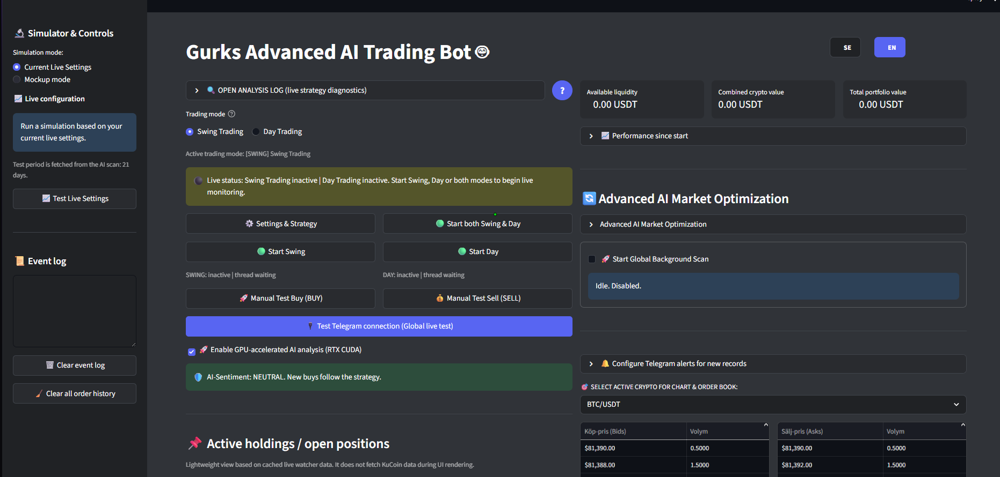
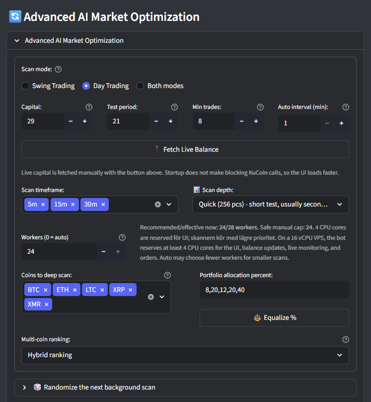
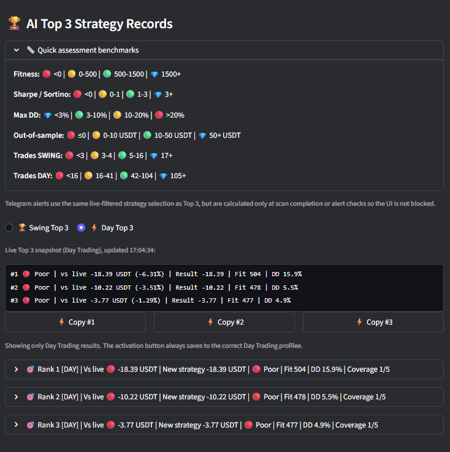
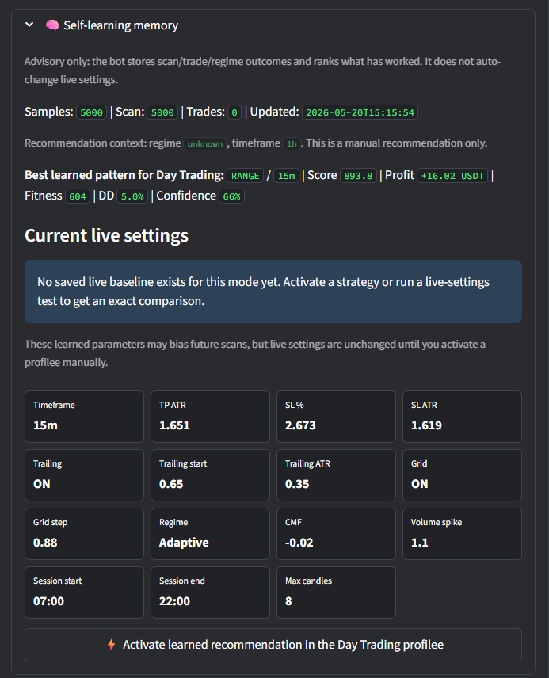

# Gurks Advanced AI Trading Bot

> Early beta KuCoin trading bot. Use at your own risk. Never trade with money you are not prepared to lose.

Gurks Advanced AI Trading Bot is a Streamlit-based crypto trading dashboard for KuCoin spot trading. It combines live monitoring, Swing/Day trading modes, strategy scanning, Top 3 strategy suggestions, Telegram reporting, persistent position memory and risk-aware optimization.

This project is in active beta. Unknown bugs can exist. Start with tiny amounts, test in simulation/mock mode first, and review every setting before enabling live trading.

## Screenshots

Main dashboard:



Advanced scan configuration:



Strategy analytics and learning:





More screenshots and historical bug-reference images are stored in [`screenshots/IMAGE_DESCRIPTIONS.txt`](./screenshots/IMAGE_DESCRIPTIONS.txt).

## Exchange Support

- Supported now: KuCoin spot trading through `ccxt`.
- Planned later: Binance and other major exchanges.

## Main Features

- Streamlit web UI with English/Swedish language switching.
- KuCoin API integration for balances, market data and live spot orders.
- Swing Trading and Day Trading modes with separate capital frames and position memory.
- Independent Swing/Day live control, so one mode or both modes can run.
- Persistent open-position tracking through `open_positions.json`, designed to survive hard restarts.
- Compact active holdings/open positions panel under the System Event Log.
- Live market watcher with RSI, EMA, Bollinger Bands, MACD, volume, ATR, regime/sentiment filters, grid logic, trailing stop loss, cooldowns and max-position checks.
- Time-exit protection that can block fee-eating exits near break-even.
- Background strategy scanner with rolling Top 250 leaderboard and Top 3 strategy cards.
- Bayesian/Optuna-ready optimization support.
- Walk-Forward Analysis and risk-adjusted metrics: Fitness, Sharpe, Sortino, Max Drawdown and out-of-sample result.
- Weighted/randomized scan variation, designed to add exploration without ignoring relevance and scoring.
- Telegram status reports, trade alerts, scan summaries, strategy alerts and optional notification controls.
- Optional login wall with PBKDF2-SHA256 hashed passwords. Login is off by default unless the user enables it.
- KCS fee-model support for KuCoin fee discount modeling.
- Runtime files are auto-created on first startup when missing.

## Complete Feature Map

This section is intentionally explicit so GitHub users can see what is already included in the current beta.

### Trading Modes And Live Control

- Swing Trading mode for slower trades and longer hold times.
- Day Trading mode for shorter intraday trades.
- Swing and Day can be started independently or together.
- Each mode has its own capital frame, live settings, cooldowns and position memory.
- Positions store their trading mode so a Swing result cannot be imported into the Day profile by mistake, and vice versa.
- Manual test buy/sell buttons are clearly marked as manual system tests.

### Persistent Bot Memory

- `open_positions.json` stores open bot-managed positions so they survive hard restarts.
- `mode_capital_state.json` tracks each mode's capital frame, realized PnL and reserved capital.
- `last_trade_state.json` supports cooldown and duplicate-buy protection across reruns/restarts.
- `trade_history.csv` stores completed trades.
- Runtime files are created automatically on first startup when missing.

### Self-Learning Memory

- The bot stores scan, trade and market-regime outcomes in `learning_memory.jsonl`.
- Aggregated learned patterns are stored in `learning_model.json`.
- The learning model ranks what has historically worked by trading mode, timeframe and market regime.
- Learned patterns can bias future scans toward historically stronger parameter zones.
- Live trades can be used as stronger feedback than pure scan results when enough data exists.
- The self-learning system is advisory by default: it does not change live settings automatically.
- The UI can show learned recommendations and lets the user manually activate a learned recommendation.
- Auto-switching is intentionally not enabled by default; it should only be considered after enough live evaluation data exists.
- Local scan results can be merged/migrated to a VPS so the always-on bot benefits from stronger offline scans.

### Strategy Scanning And Optimization

- Background scanner with configurable scan capital, test period, minimum trades, workers, scan depth and auto interval.
- Separate Swing, Day or combined scan modes.
- Multiple scan timeframes can be selected; results keep their own tested timeframe.
- Rolling Top 250 leaderboard in `optimization_results.csv`.
- Top 3 strategy cards with separate Swing/Day views.
- Top 3 cards compare candidates against the correct current live baseline.
- Identical/live-equivalent candidates can be hidden so Top 3 shows actionable alternatives.
- Bayesian/Optuna support when Optuna is installed.
- Process-pool scanning with fallback logging through `opt_processpool_errors.txt`.
- RAM-accelerated scan mode with configurable cache and CSV flush interval.
- Optional shared-memory/fork-friendly scan data path where supported.
- Scan-engine diagnostics in `scan_engine_diagnostics.json` for RAM/shared-memory state, cache size, worker count and cleanup verification.
- Weighted/randomized scanning that adds variation without ignoring scoring, market relevance or selected safeguards.
- Optional randomization of scan settings, coins and allocation, controlled separately.
- Multi-coin ranking modes: all selected coins, majority, single-coin winners, hybrid and weighted ranking.
- Strategy results can include per-coin coverage and the coins where the strategy performed best.

### Optimization Metrics

- Profit in USDT.
- Win rate.
- Trade count.
- Fitness score.
- Sharpe ratio.
- Sortino ratio.
- Max drawdown.
- In-sample and out-of-sample Walk-Forward Analysis.
- Coverage across selected coins.
- Risk-adjusted ranking profiles, including profit-focused modes with fitness protection.

### Strategy Parameters

- RSI buy threshold.
- Take Profit as ATR multiple.
- Stop Loss as fixed percent or ATR multiple.
- Trailing Stop Loss activation and distance.
- Grid Trading spacing and grid levels.
- Market-regime filter: trend, range and crash handling.
- Volume and liquidity filters.
- CMF / money-flow threshold.
- Volume-spike multiplier.
- Bollinger Band Width / squeeze-style filters.
- Trading session filter.
- Weekday filter.
- Higher-timeframe trend filter.
- Max bars in trade / time-exit.
- Time-exit fee guard, so near break-even exits can be blocked when fees would eat the trade.
- Minimum edge after estimated costs.
- Max simultaneous positions.
- Cooldown per coin.

### Risk And Execution Protection

- Duplicate-buy guard inside the live order path.
- Persistent cooldown and last-trade memory.
- Per-mode capital allocation and reserved capital tracking.
- Fee-aware PnL and scan modeling.
- KuCoin fee/KCS model support.
- Realistic execution model with spread, expected slippage, worst slippage and maximum allowed live slippage.
- Preset execution realism profiles.
- Optional order-book calibration from KuCoin public order books.
- Exit guard that can block fee-eating time exits.
- Live order logs try to use actual KuCoin fee data when the exchange returns it.

### Telegram And Notifications

- Scheduled status reports even when no trades occurred.
- Trade alerts for buys and sells.
- Scan-completion reports.
- Strategy/record alerts.
- KCS reserve warnings when enabled.
- Notification categories can be enabled/disabled from settings.
- Telegram text follows the selected UI language where possible.
- Manual Telegram tests are labeled as manual tests so they are not confused with real trades.

### UI, Logs And Analytics

- Discord-inspired dark UI theme.
- English and Swedish language switching.
- Optional login wall with PBKDF2-SHA256 hashed password storage.
- Help section with setting explanations.
- System Event Log for live trade/event messages.
- Analysis log for market-scanning details.
- Active holdings / open positions panel.
- Historical Profit Chart.
- Market Chart.
- ROI Dashboard.
- Time-of-day performance.
- False Positive Analyzer.
- Top 3 strategy cards with compact and detailed views.
- Background scan status survives page refresh/device switch through status files.

## Current UI Panels

- Simulator and controls.
- Live configuration.
- System Event Log.
- Active holdings / open positions.
- Historical Profit Chart.
- Market Chart.
- ROI Dashboard.
- Time-of-day performance.
- False Positive Analyzer.
- Advanced AI Market Optimization.
- Telegram alert configuration.
- Swing/Day Top 3 strategy cards.
- Settings and Strategy dialog.
- Help section.

## Active Holdings / Open Positions

The active holdings panel is placed directly under the System Event Log. It is intentionally lightweight.

It shows, per open bot position:

- Symbol/pair.
- Entry price.
- Current cached price.
- PnL in percent and USDT.
- Time since buy.
- Trading mode and strategy/version.
- Current trend/regime.
- Confidence/score.
- Stop loss and take profit levels.
- Trailing stop status.
- Grid sell level.
- Time-exit status.
- Latest important signal.
- Next expected exit signal.
- Why the bot is still holding the position.
- Sell conditions required for exit.

The panel does not fetch KuCoin data during UI rendering. It uses cached live watcher data and `open_positions.json` so it should not materially affect scan throughput or UI responsiveness.

## KCS Fee Discount Model

KuCoin can reduce trading fees if your KuCoin account is configured to pay fees with KCS.

What you must do manually:

1. Log in to KuCoin.
2. Enable KuCoin's account setting for paying trading fees with KCS.
3. Keep a small KCS balance on the account.
4. In the bot, enable the KCS fee model only if your KuCoin account actually uses KCS fee deduction.

Suggested reserve:

- Light testing: about 5-10 USDT worth of KCS.
- Active day trading: about 10-25+ USDT worth of KCS.

What the bot does:

- Models scans, backtests, Top 3, mock tests and PnL using the configured fee model.
- Tries to read actual fee information from KuCoin orders when the API returns it.
- Can warn when the estimated KCS reserve is low.

What the bot cannot guarantee:

- It cannot force KuCoin to use KCS for fees per order through `ccxt`.
- If your KCS reserve runs out, KuCoin may charge normal fees instead.
- Changing the fee model later does not rewrite old exchange fills.

## Important Risk Notice

This bot can place real orders when live trading is enabled and valid KuCoin API keys are configured.

You are responsible for:

- API key permissions and IP restrictions.
- Exchange account security.
- Understanding the strategy settings.
- Monitoring open positions.
- KuCoin fees, spread, slippage and liquidity.
- Verifying behavior with small amounts before using meaningful capital.

Recommended first run:

1. Start without API keys, or with read-only keys if you only want to inspect UI behavior.
2. Use mock/simulation mode first.
3. Configure Telegram and send a test message.
4. Run Test Live Settings.
5. Run a small background scan.
6. Review Top 3 and active holdings behavior.
7. Only then enable live trading with very small capital.

## Hardware Requirements

The bot can start on small machines, but strategy scanning is CPU-heavy. Weak hardware can make the UI feel slow.

Practical minimum worth using:

- CPU: 4 vCPU / 4 logical cores.
- RAM: 8 GB.
- Storage: 30+ GB SSD/NVMe.
- OS: Ubuntu 24.04 VPS or Windows 10/11.
- Network: stable internet connection.

Recommended for live trading plus normal scanning:

- CPU: 8 vCPU.
- RAM: 16-24 GB.
- Storage: 80+ GB NVMe preferred.
- Network: stable VPS connection, ideally accessed through Tailscale/VPN.

Recommended for heavy/Brutal VPS scanning:

- CPU: 16 vCPU.
- RAM: 32-64 GB.
- Storage: 150+ GB NVMe.
- Network: stable 1 Gbit/s VPS network.

More CPU mainly improves background scanning. It does not guarantee better trades. Always reserve enough CPU for Streamlit, live watcher, balance updates and order handling.

## Installation

### Windows

1. Download or clone this folder.
2. Open the folder containing `bot.py`.
3. Double-click `install_dependencies.bat`.
4. Copy `example.env` to `.env`.
5. Fill in your own KuCoin and Telegram values.
6. Start the bot:

```bat
venv\Scripts\activate
streamlit run bot.py --server.address 0.0.0.0 --server.port 8501
```

### Ubuntu 24.04 VPS

```bash
sudo apt update
sudo apt install -y python3 python3-venv python3-pip git screen

cd /path/to/your/bot/folder
chmod +x install_dependencies.sh
./install_dependencies.sh

cp example.env .env
nano .env

screen -S tradingbot
source venv/bin/activate
streamlit run bot.py --server.address 0.0.0.0 --server.port 8501
```

Detach from `screen` with `CTRL+A`, then `D`.

## Environment Variables

Required for live KuCoin trading:

- `KUCOIN_API_KEY`
- `KUCOIN_SECRET` or `KUCOIN_API_SECRET`
- `KUCOIN_PASSPHRASE`, `KUCOIN_API_PASSWORD` or `KUCOIN_PASSWORD`

Required for Telegram:

- `TELEGRAM_BOT_TOKEN`
- `TELEGRAM_CHAT_ID`

Optional runtime/performance controls:

- `BOT_UI_RESERVED_CORES`
- `BOT_OPT_MAX_WORKERS`
- `BOT_OPT_WORKERS_FORCE`
- `BOT_DISABLE_LOGIN`
- `BOT_DISABLE_AUTORUN`

## Upcoming Development Roadmap

Planned future work discussed for the project:

- Stronger multiprocessing/shared-memory scan engine. Current beta includes guarded shared-memory mapping, parent-owned cleanup and scan diagnostics; deeper explicit shared-memory benchmarking remains planned.
- More advanced RAM-accelerated indicator cache. Current beta includes compact NumPy indicator arrays, RAM cache limits and flush controls; the next step is broader precomputed indicator reuse across scan cycles.
- Smarter AI market-regime models.
- Better portfolio/risk engine.
- More exchange connectors, starting with Binance.
- More robust mobile UI and lighter live-refresh paths.
- Expanded KCS fee monitoring and optional cautious KCS top-up logic.
- More strategy analytics and scan-quality diagnostics.

Feedback and bug reports are appreciated. This is beta software and real user testing is valuable.
